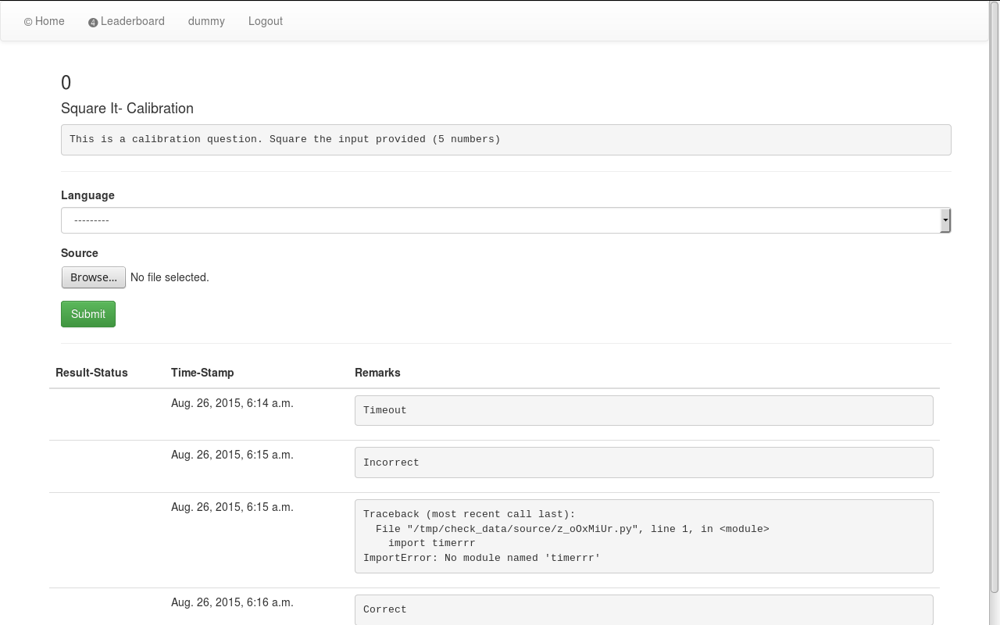
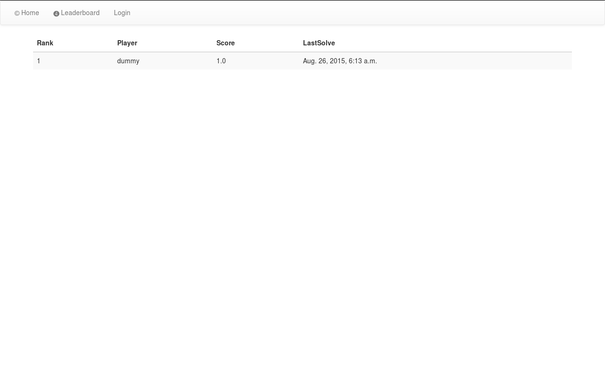

Judge-Interface
===============

This is the default interface for [openjudge](https://github.com/theSage21/openjudge).


Setup
-----

```
$ cd ~
$ git clone https://github.com/theSage21/judge-interface.git
$ cd judge-interface
$ ./setup.sh
```

Usage
-----

```
$ cd ~
$ cd judge-interface
$ source env/bin/activate
$ ./runserver.sh
```


The Django admin provides:

- Add participants
- Add Questions and Answers
- Add languages


Screenshots
-----------

Main screen

Question View

Question List

Leaderboard



TroubleShooting
---------------

- No webpage
    - This might be because of several reasons.
    - Check if a web page is served at `localhost:8000`
    - If not open an issue here and we will solve it.
- No CSS and JS
    - Perhaps your user does not have enough permissions?
    - Try this solution for nginx. [Stackoverflow](stackoverflow.com/questions/20182329/nginx-is-throwing-an-403-forbidden-on-static-files#answer-27995598)
    - If that does not solve it, open an issue


Any other issue and you can open an issue on github itself and we will
try to solve it
